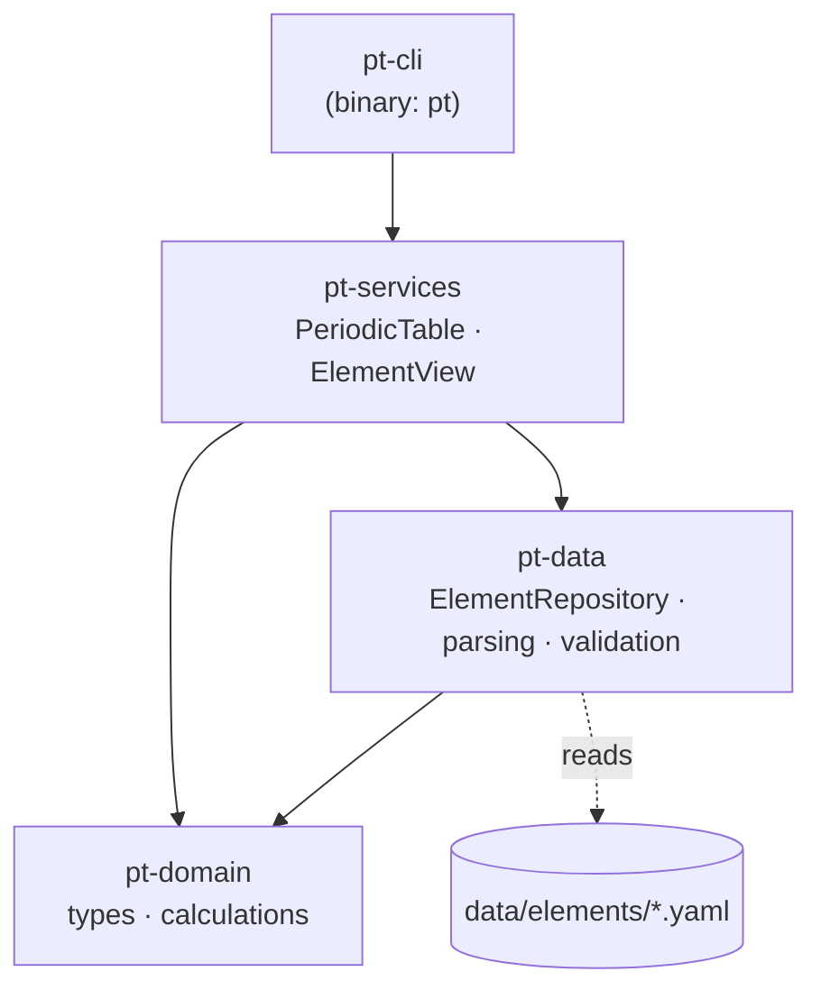
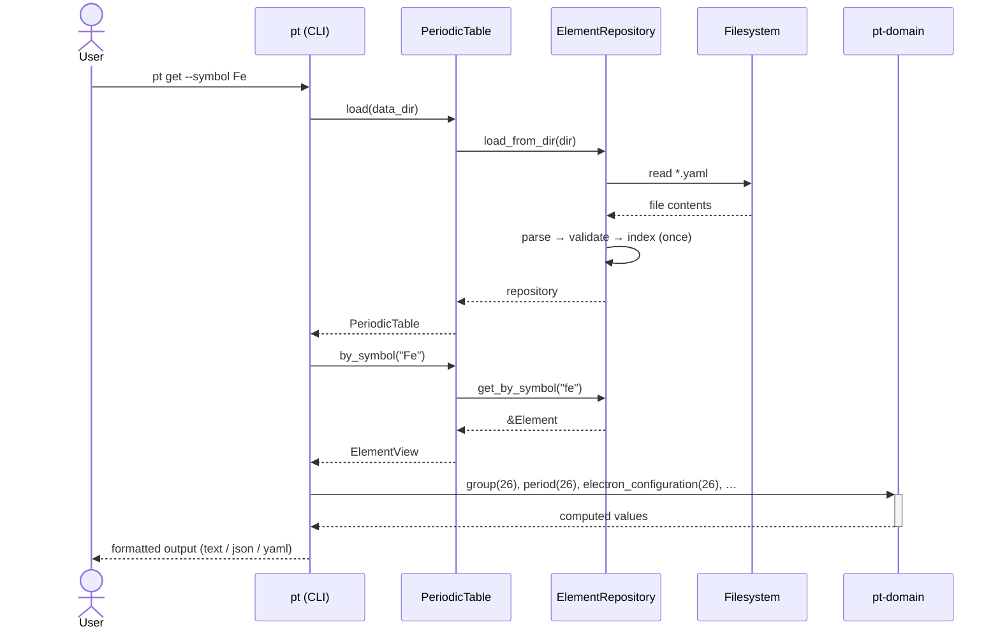
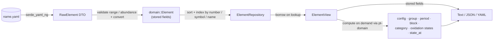

# Periodic Table

A Rust library (plus a small CLI) that provides programmatic access to the
properties of the 118 chemical elements. Element data is maintained as
human-editable YAML files — one per element — and the library cleanly separates
**stored** empirical/historical data from **computed** properties that are
derived at runtime from first principles.

- **Stored** (loaded from YAML): atomic number, name, symbol, atomic mass, mass
  number, melting/boiling point, density, electronegativity, state, isotopes,
  discovery year, discoverer.
- **Computed** (derived on demand): electron configuration (Aufbau + Pauli +
  Hund, with a ground-state anomaly table), group, period, block, category,
  heuristic oxidation states, isotope-weighted atomic mass, and physical state at
  an arbitrary temperature.

---

## Workspace layout

```
periodic-table/
├── Cargo.toml                 # workspace manifest
├── data/elements/*.yaml       # 118 element files (source of truth)
└── crates/
    ├── pt-domain/             # pure value types + stateless calculations
    ├── pt-data/               # YAML loading + indexed repository
    ├── pt-services/           # query API (PeriodicTable, ElementView)
    └── pt-cli/                # the `pt` binary
```

Dependencies flow in one direction only:



- **`pt-domain`** — no I/O, no serialization. Defines `Element`, `Isotope`,
  `StateOfMatter` and the stateless calculation functions.
- **`pt-data`** — owns serde DTOs, parses/validates YAML into domain types, and
  builds an in-memory `ElementRepository` (loaded once) indexed by atomic number,
  symbol, and name.
- **`pt-services`** — the public query API. `PeriodicTable` looks elements up;
  `ElementView` merges an element's stored fields with its computed properties.
- **`pt-cli`** — a thin binary named `pt` over `pt-services`.

---

## Building and testing

```bash
cargo build --workspace      # build everything
cargo test --workspace       # run all unit + integration tests
cargo run -p pt-cli -- --help
```

---

## User guide (library)

The crates are path/workspace members and are not published to crates.io. To use
the library from another crate in this workspace, depend on `pt-services` (it
re-exports everything you need and pulls in `pt-domain`):

```toml
[dependencies]
pt-services = { path = "crates/pt-services" }
pt-domain   = { path = "crates/pt-domain" }   # for the Block/Category/... types
```

Load the table once at startup, then query it:

```rust
use pt_services::PeriodicTable;

fn main() -> Result<(), Box<dyn std::error::Error>> {
    // Reads every data/elements/*.yaml, validates, and indexes them.
    let table = PeriodicTable::load("data/elements")?;

    // Look up by atomic number, symbol (case-insensitive), or name.
    let fe = table.by_symbol("fe").expect("iron is present");

    // Stored properties live on the underlying Element.
    let e = fe.element();
    println!("{} ({}) — atomic mass {}", e.name, e.symbol, e.atomic_mass);

    // Computed properties are derived on access.
    println!("electron config : {}", fe.electron_configuration());
    println!("group / period  : {} / {}", fe.group(), fe.period());
    println!("block           : {:?}", fe.block());
    println!("category        : {:?}", fe.category());
    println!("oxidation states: {:?}", fe.oxidation_states().0);

    // Physical state at a chosen temperature (needs melting/boiling points).
    println!("state @ 2000 K  : {:?}", fe.state_at(2000.0)); // Some(Liquid)

    // Atomic mass recomputed from the stored isotope abundances.
    println!("mass (isotopes) : {:?}", fe.computed_atomic_mass());

    // Nearest element within a mass tolerance.
    if let Some(v) = table.by_atomic_mass(55.8, 0.5) {
        println!("nearest to 55.8 : {}", v.element().symbol);
    }

    // Iterate over the whole table.
    let metals = table.all().filter(|v| v.block() == pt_domain::Block::D).count();
    println!("d-block elements: {metals}");
    Ok(())
}
```

Lookups return `Option<ElementView>` — `None` means "not found" (not an error).
`PeriodicTable::load` returns `Result<_, ServiceError>`; loading fails only on I/O
or data-validation problems.

---

## How to use the CLI

The binary is named `pt`. From the repository root the default data directory
(`./data/elements`) is used automatically.

```bash
# Look up a single element (by number, symbol, name, or nearest atomic mass)
cargo run -p pt-cli -- get --number 26
cargo run -p pt-cli -- get --symbol Fe
cargo run -p pt-cli -- get --name iron
cargo run -p pt-cli -- get --mass 55.8

# List every element
cargo run -p pt-cli -- list

# Choose an output format and/or a custom data directory
cargo run -p pt-cli -- --format json get --symbol O
cargo run -p pt-cli -- --format yaml get --number 8
cargo run -p pt-cli -- --data-dir ./data/elements list
```

After `cargo build`, the binary is at `target/debug/pt`:

```bash
target/debug/pt get --symbol Fe
```

### Flags

| Flag | Default | Description |
|------|---------|-------------|
| `--data-dir <PATH>` | `./data/elements` | Directory of element YAML files (global) |
| `--format <FMT>` | `text` | Output format: `text`, `json`, or `yaml` (global) |

### `get` selectors (use one)

`--number <Z>` · `--symbol <SYM>` · `--name <NAME>` · `--mass <U>` (nearest within ±0.5 u)

### Example output (`get --symbol Fe`, text)

```
Iron (Fe) — atomic number 26
  atomic mass:       55.845
  mass number:       56
  electron config:   1s2 2s2 2p6 3s2 3p6 3d6 4s2
  group / period:    8 / 4
  block:             d
  category:          TransitionMetal
  state (STP):       solid
  melting point (K): 1811
  boiling point (K): 3134
  density (g/cm³):   7.874
  electronegativity: 1.83
  oxidation states:  2, 3
  discovered:        — (—)
```

Unmeasured/unknown fields render as `—`. A `get` with no match exits non-zero with
`error: no matching element found`.

---

## Sequence diagram — a lookup

What happens for `pt get --symbol Fe`:



---

## Data flow

How a single element's data moves from disk to output:



Validation performed by `pt-data` while loading: atomic number in `1..=118`;
unique atomic number, symbol, and name; isotope abundances sum to ≈ 1.0 (±0.01);
required fields present.

---

## Property reference

| Property | Source | Notes |
|----------|--------|-------|
| atomic_number, name, symbol | stored | identity / lookup keys |
| atomic_mass, mass_number | stored | standard atomic weight (u) / representative isotope |
| melting_point, boiling_point | stored | Kelvin; `null` when unmeasured |
| density | stored | g/cm³ |
| electronegativity | stored | Pauling scale; `null` for some elements |
| state | stored | `solid` / `liquid` / `gas` at STP |
| isotopes | stored | mass number, relative mass, abundance |
| discovery_year, discoverer | stored | `null` for ancient/synthetic elements |
| electron_configuration | **computed** | Aufbau (Madelung order) + Pauli capacities + ~19-element anomaly table |
| group, period, block | **computed** | from the configuration (f-block → group 3 by convention) |
| category | **computed** | heuristic (alkali metal, noble gas, metalloid, …) |
| oxidation_states | **computed** | heuristic, group-based |
| computed_atomic_mass | **computed** | abundance-weighted isotope mean |
| state_at(T) | **computed** | from stored melting/boiling points |

### Caveats

- `category` and `oxidation_states` are best-effort heuristics, **not**
  authoritative chemical references.
- `block`/`period` are derived from the *naive* Aufbau fill, so ground-state
  anomalies (e.g. palladium dropping its 5s electrons) do not shift an element's
  row or block.
- The 118-element dataset uses best-effort standard reference values; synthetic
  superheavy elements omit unmeasured properties, and some elements use a single
  representative isotope.

---

## YAML schema

Each `data/elements/<name>.yaml` looks like:

```yaml
atomic_number: 1
name: Hydrogen
symbol: H
atomic_mass: 1.008
mass_number: 1
melting_point: 13.99          # Kelvin (optional)
boiling_point: 20.271         # Kelvin (optional)
density: 0.00008988           # g/cm³ (optional)
electronegativity: 2.20       # Pauling scale (optional)
state: gas                    # solid | liquid | gas
discovery_year: 1766          # optional
discoverer: Henry Cavendish   # optional
isotopes:                     # optional; abundances should sum to ≈ 1.0
  - { mass_number: 1, relative_mass: 1.007825, abundance: 0.999885 }
  - { mass_number: 2, relative_mass: 2.014102, abundance: 0.000115 }
```

To add or correct an element, edit (or create) its YAML file and reload — no code
changes required.

---

## Documentation

- Design spec: `docs/superpowers/specs/2026-05-29-periodic-table-design.md`
- Implementation plan: `docs/superpowers/plans/2026-05-29-periodic-table.md`
- API docs: `cargo doc --workspace --no-deps --open`
